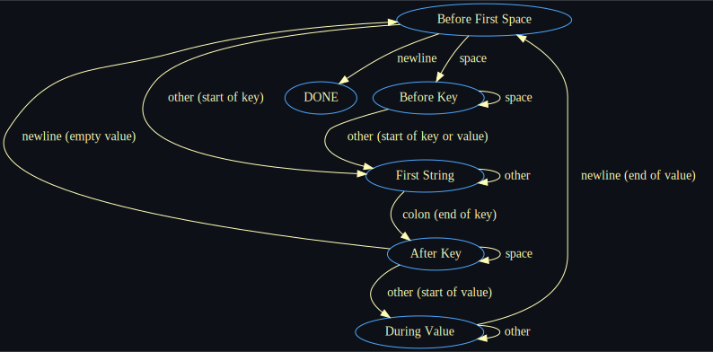

## MinHTTP

Minimal HTTP 1.0 and 1.1 parser and builder for requests and responses.

* no memory allocations
* no dependencies

### How to Use

There is two options:
* Build library and include it in your project
* Just copy `minhttp.c` and `minhttp.h` to the proper locations in your project.

### How to Build

1. `mkdir build/`
2. `cd build/`
3. `cmake .. && cmake --build .`

### How to Test

In `build/`: `./test` or `./test --quiet` (for no output on success).

The tests are based on the ones from [picohttpparser](https://github.com/h2o/picohttpparser/blob/master/test.c). Be aware that changes have been made due to difference between what is accepted:
* `picohttpparser` allows "keyless" values. This project doesn't 
    * compare their "parse multiline" test and this project's "parse_headers_multiline_success_example_test" and "parse_headers_multiline_example_test"

### Roadmap

- [ ] parsers
    - [x] request first line parser
    - [x] header parser
    - [x] add CMakeLists.txt
    - [x] add tests for request first line from picohttpparser
    - [x] add tests for header parser  from picohttpparser
    - [ ] request parser
    - [ ] add tests from request parser from picohttpparser
    - [ ] response first line parser
    - [ ] response parser
- [ ] builder
    - [ ] header builder
    - [ ] response first line builder
    - [ ] response builder
    - [ ] request first line builder
    - [ ] request builder
- [ ] benchmarking and optimizations
    - [ ] enable NULL arguments for faster parsing
    - [ ] benchmark against other http parsers
        - [ ] picohttpparser
        - [ ] llhttp
    - [ ] add likely and unlikely in all appropriate jumps
    - [ ] parse only requested headers (`mh_parse_headers_set`)
        - [ ] get max key len automatically

### Header Parser State Machine

|        x           |      Line Start      |       First String        |     After Key     |       During Value       |  DONE   |
|--------------------|----------------------|---------------------------|-------------------|--------------------------|---------|
|Line Start          |                      |    other(start of key)    |                   |                          | newline |
|First String        |                      |           other           | colon(end of key) |                          |         |
|After Key           | newline(empty value) |                           |       space       |    other(start of value) |         |
|During Value        |        newline       |                           |                   |          other           |         |
